# <div align="center"> 代码与结果的简单介绍</div>

## openslide函数的相关用法
使用openslide对WSI（全扫描）图像进行处理，下面是openslide函数的相关用法：

```python
image = openslide.OpenSlide(silidepath)   #读取WSI图像，slidepath为图像的路径
level = image.level_count   #WSI图像的层级
rvl = image.level_dimensions[i]   #输出i层的图像分辨率
downsample_image = image.level_downsamples[i]   #对i层的图像进行下重采样
best_downsample_level = image.get_best_level_for_downsample(5.0)   #对给定的下采样因子返回图像下采样的级别
result = np.array(image.read_region((0, 0), 3, (224, 224)))   #(0,0）代表起始像素点，3代表需要处理的层级，（224,224)代表处理得到的像素大小
```
### 解决思路流程图

整体的解决思路为：首先训练图像分割模型，以ResNet34为基础模型进行训练，先使用ResNet对每张WSI每个层级图像进行扫描，给出该切片是癌症的概率，接着将每张WSI最高概率的切片送入模型，更新ResNet的参数，下面是模型架构：

<div align="center">
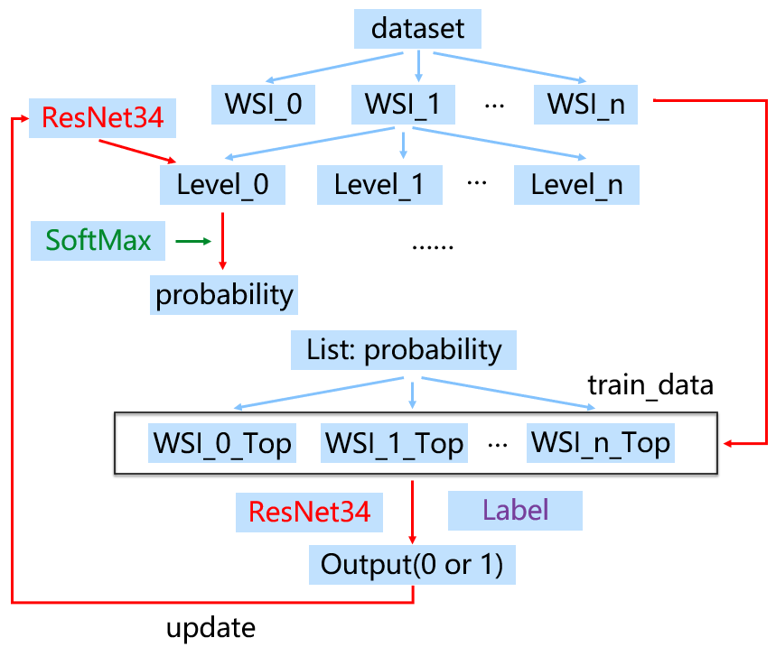
</div>

接着使用训练好的ResNet模型，扫描WSI图像的每个层级图像，得到S个病变概率最大的区域送入RNN或者Attention模型进行训练，更新参数，下面是RNN架构图：
<div align="center">
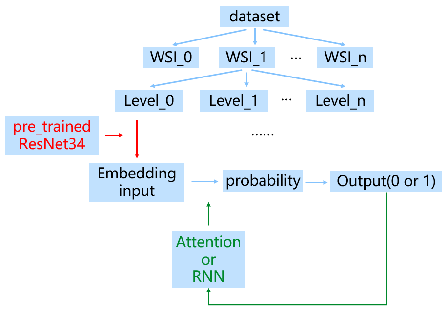
</div>

## 病理切片可视化
对淋癌病理切片 `2023-11-21 12_18_01.svs_0.png` 进行可视化，该癌症切片共有`7`个级别，其分辨率从大到小分别为`[(88084, 39276),(22021, 9819),(5505, 2454),(1376, 613),(344, 153),(86, 38),(21, 9)]`,下面对该切片`3-5`三个层级进行展示：

```python
import matplotlib.pyplot as plt

plt.figure(1)
plt.imshow(result)   #result为read_region方法返回的图像数组
plt.savefig(image_path)   #iamge_paath为存储路径
plt.show()
```

* `"级别3"`: 分辨率为：`(1376, 613)`

<div align="center">

</div>

* `级别4`: 分辨率为：`(344, 153)`
<div align="center">

</div>

* `级别5`: 分辨率为：`(86, 38)`
<div align="center">

</div>


## 数据处理
WSI图像作为输入时，其层级必须保持一致，由于数据集的限制，故从以下两个图像层级角度进行研究和对比，分别是图像层级设置为3和7，训练集、验证集和测试集的比例均为`6:2:2`，targets代表数据的标签，0为正常切片，1为癌症切片，下面为数据集的结构：
```python
XXX_data = {
        'slides': slides[:tr_0] + slides[database:database+tr_1], #WSI的存储路径
        'grid': grid[:tr_0] + grid[database:database+tr_1], #WSI的每一级图像分辨率大小
        'targets': targets[:tr_0] + targets[database:database+tr_1], #WSI图像的标签，0表示正常切片，1表示癌症切片
        'mult': mult, #图像的缩放比例，默认为1，从而决定是否要插值
        'level': level, #WSI图像的起始层级，默认为0
        }
```

* `level（7）`：处理的到的数据两位train ：val ：test = 14 : 4 : 7，训练、验证和测试集中均有癌症切片和正常切片，其中`targets`的分布分别为：

```python
train：[0, 0, 0, 1, 1, 1, 1, 1, 1, 1, 1, 1, 1, 1]
val：  [0, 1, 1, 1]
test： [0, 0, 1, 1, 1, 1, 1]
```
* `level（3）`：train ：val ：test = 30 : 9 : 12，训练、验证和测试集中均有癌症切片和正常切片，其中`targets`的分布分别为：

```python
train：[0, 0, 0, 0, 0, 0, 0, 1, 1, 1, 1, 1, 1, 1, 1, 1, 1, 1, 1, 1, 1, 1, 1, 1, 1, 1, 1, 1, 1, 1]
val：  [0, 0, 1, 1, 1, 1, 1, 1, 1]
test： [0, 0, 0, 1, 1, 1, 1, 1, 1, 1, 1, 1]
```
## 训练结果
Resnet模型和RNN模型均训练100个epoch，统计训练过程中的loss以及在测试集上的准确率，下面为详细的结果：

### 层级为7

RseNet模型:

* `loss曲线`：
<div align="center">
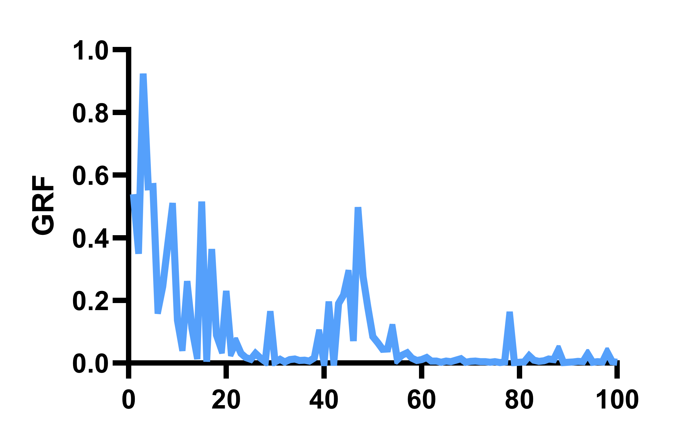
</div>

* `测试准确率`：71%
<div align="center">
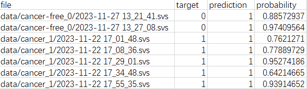
</div>

RNN模型:

* `loss曲线`：
随着batch_size的增大，模型的loss降低，当batch_size过小时，出现nan值，但受限于数据量，batch无法增大，虽然loss保持稳定，但是相对值较大，只能通过增加数据量解决。
<div align="center">
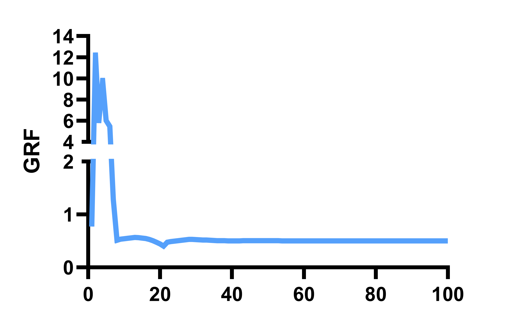
</div>

* `测试准确率`：71%
<div align="center">
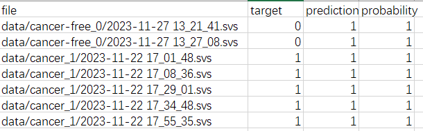
</div>


### 层级为3

RseNet模型:

* `loss曲线`：
<div align="center">
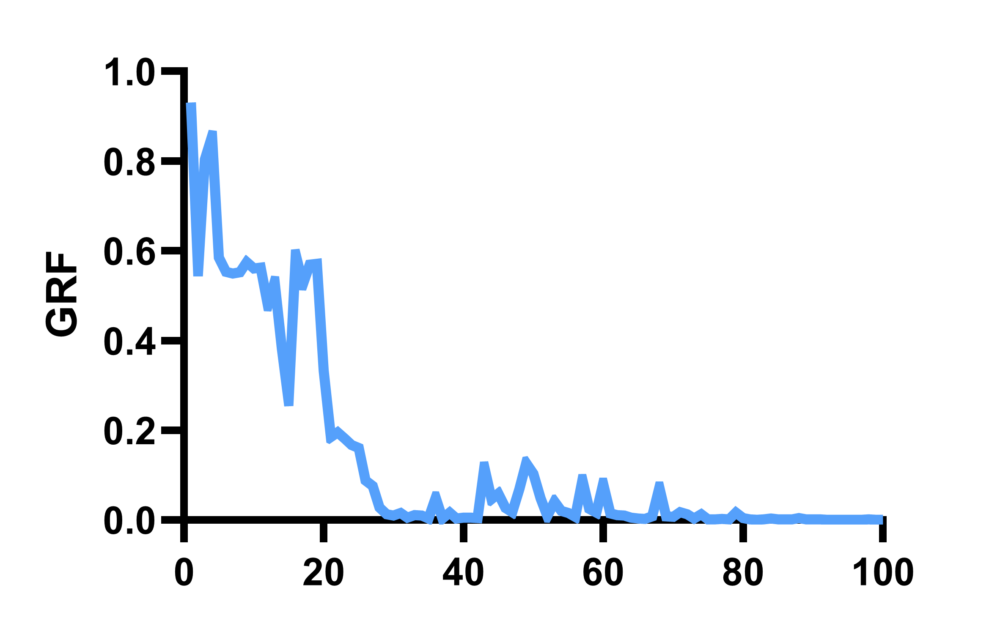
</div>

* `测试准确率`：50%
<div align="center">
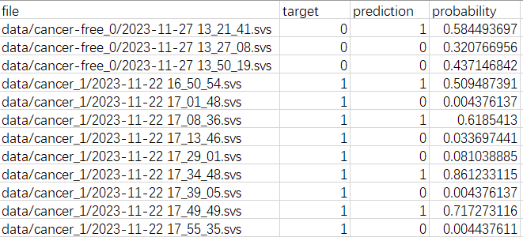
</div>

RNN模型:

* `loss曲线`：
随着batch_size的增大，模型的loss降低，当batch_size过小时，出现nan值，但受限于数据量，batch无法增大，虽然loss保持稳定，但是相对值较大，只能通过增加数据量解决,loss表现的极其不稳定，且容易出现过拟合情况，原因为数据量太少。
<div align="center">
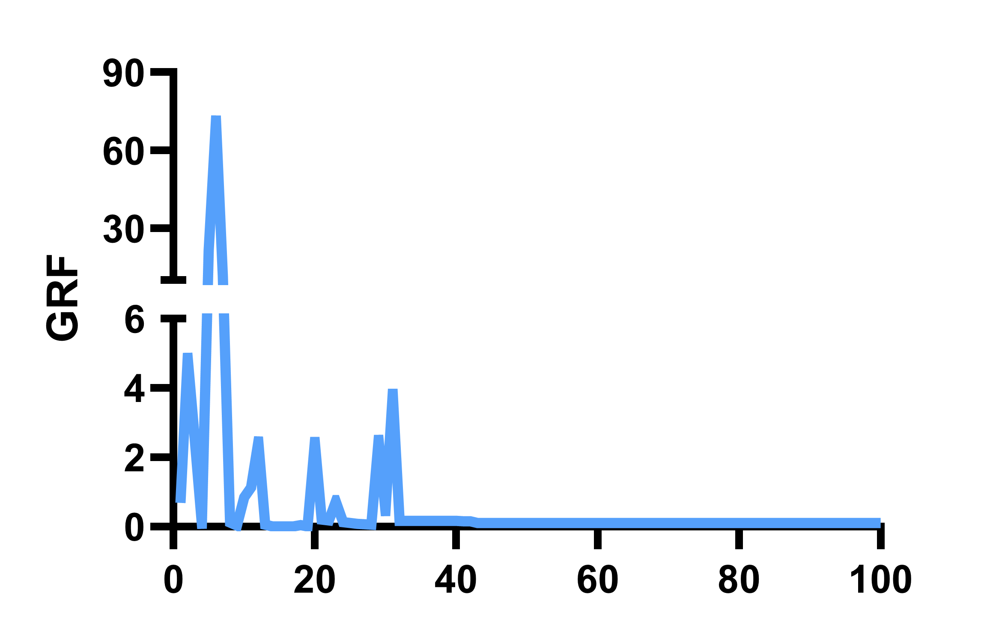
</div>

* `测试准确率`：42%
<div align="center">
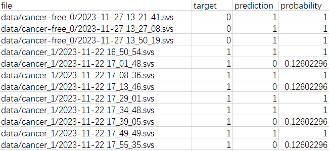
</div>

## 结果分析
1、数据量少，导致模型严重过拟合，在验证集和测试集上表现较差，同时，数据量少导致的模型batch_size小，影响着模型的准确率，通过训练发现，batch_size在64以下时，模型loss会随着batch_size增大而减小，准确率会提升；
2、模型对正常切片的预测效率差，原因是正常切片的数量少于癌症切片，模型在学习时没有充分学到正常切片的特征，导致对正常切片预测准确率低；
3、通过比较发现，当WSI图像的层级越高时，模型预测的准确率越高，但是受限于数据本身，该结论的可靠性还需要验证。


## 补充
Attention模型：在训练集上表现良好，但在测试集上表现很差，表现出过拟合，并且受学习率影响很大原因为数据量太少。

* train曲线
<div align="center">
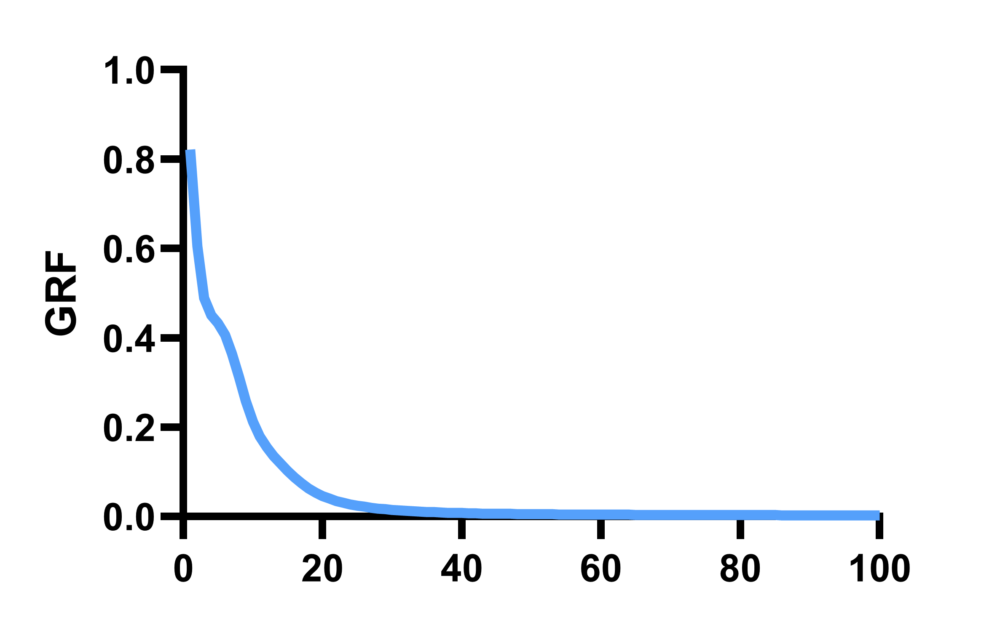
</div>

* val曲线
<div align="center">
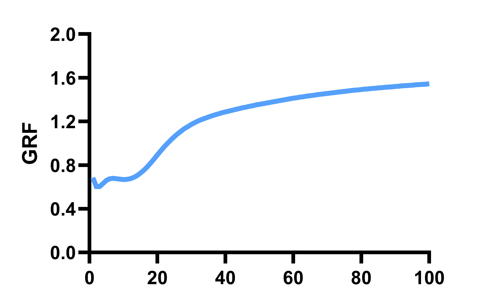
</div>


